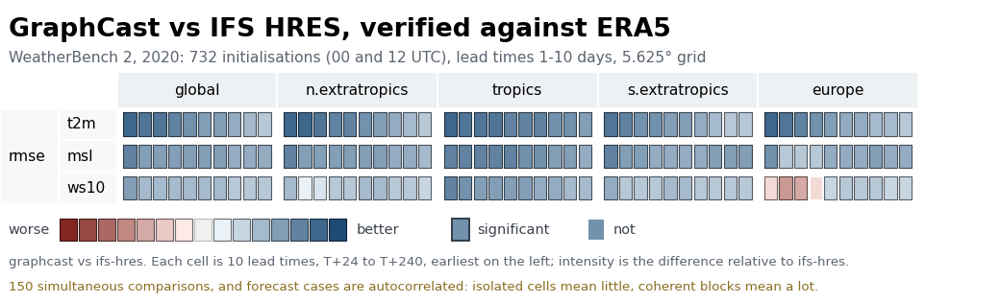

# mlwp-scorecard

Weather forecasting scorecards for machine-learning weather prediction.



*GraphCast compared with IFS HRES, both verified against ERA5, over 2020
(WeatherBench 2 data on its 5.625° grid, so the Europe region is only a few grid
points). Blue is better than HRES, red worse; a dark frame marks a significant
difference. [Open the interactive version](https://raw.githack.com/mlwp-tools/mlwp-scorecard/main/docs/images/scorecard.html)
(hover for values, click any cell for its charts; the file is
[`docs/images/scorecard.html`](docs/images/scorecard.html)). Both are made by
[`docs/example/`](docs/example/).*

When a forecasting system changes, the question is rarely "is it good?" but "is it
better than what we already have, and **where is it worse**?" The evidence runs to
thousands of numbers — every variable, level, spatial region, metric and lead time —
and nobody reads thousands of line plots. A scorecard puts them on one page you can scan
in a minute, so a net improvement, an isolated regression, and the difference between
a real effect and sampling noise are all visible at once.

It compares **one or more forecast sources with a baseline source, all already
scored against a common truth source**, and colours the *paired difference between
their scores*. "Better" means better than the baseline, not better than truth.

This package does no scoring: metrics are computed upstream, where the fields
are. It takes one score per forecast case and performs the collapse over those
cases itself — the mean, its bootstrap interval, and the *paired* difference that
decides significance. That last one is why it wants per-case input: pairing has
to happen before the averaging, and cannot be recovered afterwards.

## Install

```bash
uv add mlwp-scorecard            # HTML output
uv add "mlwp-scorecard[static]"  # + matplotlib PNG/SVG/PDF
```

## Use

```python
from pathlib import Path

import xarray as xr
from mlwp_scorecard import ScoreCard

ds = xr.open_dataset("verification_summary.nc")

score_card = ScoreCard(
    ds,
    baseline="IFS-HRES",
    select=dict(forecast_source=["GraphCast"]),
    title="GraphCast vs IFS HRES",
)
fig = score_card.to_figure()                             # a matplotlib Figure
fig.savefig("scorecard.png", dpi=200)
Path("scorecard.html").write_text(score_card.to_html())  # a self-contained page
```

Building the card does all the work; `to_figure()` and `to_html()` only draw it,
and saving is yours to do. Nothing is guessed or quietly relaxed on the way:
input the card cannot honestly be drawn from raises an error naming the choice
that would resolve it, and every choice that was made is printed on the card.

The figure is not registered with `pyplot`, so it does not pile up over repeated
builds, and it saves with your matplotlib settings. For PDF and SVG text that
stays selectable, set `pdf.fonttype=42` and `svg.fonttype="none"` (the command
line does this for you).

### Colour schemes

The palette is chosen when the card is drawn, not when it is built, so one card
can be drawn in either:

```python
score_card.to_html()                        # "cvd", the default: colour-vision-safe
score_card.to_figure(colour_scheme="ecmwf") # the ECMWF reference palette
```

On the command line, pass `--colour-scheme ecmwf`. `mlwp_scorecard.SCHEMES`
lists the palettes by name.

### Rows and columns

Rows and columns are inferred from the dataset, or named explicitly:

```python
score_card = ScoreCard(
    ds,
    baseline="IFS-HRES", select=dict(forecast_source=["GraphCast"]),
    rows=["truth_source", "variable", "level"],
    columns=["spatial_region", "metric"],
    cell="lead_time",
)
```

The same file yields another card by naming different sources, so which source is
truth, baseline or forecast is an argument rather than something baked into the data.

### Selecting

Every choice of *which* values appear, and in what order, goes through `select=`,
one rule for every coordinate:

```python
select=dict(
    forecast_source=["GraphCast", ...],   # a list: kept, in this order; ... = the rest
    truth_source="observations",          # one value: picked, and the axis dropped
    spatial_region=["europe", "n.hem"],   # rows and columns follow the order given
    init_time=slice("2024-01-01", "2024-03-31"),   # a slice: as ds.sel would
)
```

- A **single value** picks that member and drops the dimension — unless you
  named the dimension in `rows=`, `columns=` or `cell=`, where it is kept one
  entry long. So `rows=["truth_source", ...]` with `truth_source="analysis"` still
  gives a one-row truth block.
- A **list** keeps the dimension, subset, **in the order given**, which is the
  order it is drawn in. `...` stands for every value not otherwise named, in
  coordinate order, at most once.
- A **slice** keeps the dimension, as `ds.sel` would.
- `variable` and `metric` can be selected and ordered too; they always stay on an
  axis.

`forecast_source` follows the same rule, with one difference: the baseline is left
out of every `...` automatically, and naming it explicitly is an error. Leaving
`forecast_source` out is the same as `[...]` — every source but the baseline.

### Several forecast sources against one baseline

Select several sources and `forecast_source` becomes a layout axis — outermost on
the rows unless you place it — with one block of rows per source, each compared
with the `baseline`:

```python
score_card = ScoreCard(
    ds,
    baseline="IFS-HRES",
    select=dict(forecast_source=["GraphCast", "AIFS", "Aurora"],
                truth_source="analysis"),
    rows=["forecast_source", "variable", "level"],
    columns=["metric"],
)
```

Every row is exactly the two-source card for that source: the resample is shared
by all of them, so the rows are consistent with one another.

`cases=` says which forecast cases each comparison rests on, and the card says
which was used:

- `"common"` (the default): only the cases **every** selected source and the
  baseline scored. Rows are comparable with one another, but a source that runs
  one cycle a day cuts the case count for all of them.
- `"pairwise"`: the cases each forecast source shares with the baseline. Each row
  uses as much data as it can, but the rows no longer rest on the same weather and
  should not be ranked against one another.

With one forecast source the two are the same.

### Showing values, and cards with no baseline

`baseline=` decides the comparison -- the colouring and the significance -- and
nothing else. `show_values=True` prints each source's own score in its boxes, as
Brightband's OWB scorecard does:

| `baseline` | `show_values` | card |
|---|---|---|
| `"IFS-HRES"` | False | boxes coloured by the paired difference from IFS-HRES |
| `"IFS-HRES"` | True | the same colours and borders, each box printing its own score, and IFS-HRES as a grey row of its own scores, first |
| None | True | every source a row of its own scores on grey: nothing compared, nothing marked significant |
| None | False | an error: there would be nothing on the card |

```python
ScoreCard(ds, baseline="IFS-HRES", show_values=True,
          select=dict(forecast_source=["GraphCast", "AIFS"]))
ScoreCard(ds, show_values=True)   # every source, no baseline
```

With values shown every source has a row of its own, so `forecast_source` is on an
axis even for a single forecast source — outermost on the rows unless you place it.
The boxes widen to fit a number, which suits cards with a handful of lead times.
The baseline's grey row is over the same cases the other rows were compared on
under `cases="common"`, and over all of its own cases under `"pairwise"`. With no
baseline, `cases="common"` averages every source over the cases all of them scored.

There is no configuration object to build: coordinate names and source names are
all the API has. The command line takes the same arguments, plus where to write:

```bash
mlwp.make_scorecard verification_summary.nc \
    --baseline IFS-HRES --select forecast_source=GraphCast \
    --html-path scorecard.html --image-path scorecard.png
```

`--show-values` prints values; leave out `--baseline` with it for a card
of absolute scores. `--open` opens each file written in the system's default
viewer. `--select DIM=V1,V2` is repeatable and follows the same rule: no comma is a single
value, commas make a list (`--select forecast_source=GraphCast,...`), and a
trailing comma makes a list of one (`--select spatial_region=europe,`). Values
are read as the coordinate's type, so `--select level=500` selects 500.0.

`--html-path` is the interactive page and must end in `.html`. `--image-path` is
the static figure, and is repeatable; each one's format follows its suffix
(`.png`, `.pdf`, `.svg`, ...), so `--image-path card.png --image-path card.pdf`
writes both. At least one of the two is required, and a suffix that contradicts
its flag is refused before anything is computed.

The HTML page is self-contained — no CDN, no analytics, no webfonts, so it works
offline and from `file://`. Hover a box for its value, use the checkboxes to filter
columns, and click a cell for a drill-down showing the difference over lead time
and both sources' own values with their confidence intervals. The charts are
generated SVG rather than a plotting library.

## Input

One variable per `{metric}.{physical_variable}` pair, holding that metric's value
**for each forecast case** (different forecast runs) — not yet averaged over them. The naming convention is
[WeatherBench-X](https://github.com/google-research/weatherbenchX)'s, and its
`Aggregator.reduce_dims` is a required argument, so leaving `init_time` out of it
gives exactly this shape. Everything else is a coordinate.

A variable omits the dimensions that do not apply to it: `msl` (mean sea-level
pressure) simply has no `level`, and a metric that needs an ensemble simply has
no variable for the fields that lack one.

```
<xarray.Dataset>
Dimensions:  (truth_source: 2, forecast_source: 2, level: 7, spatial_region: 10,
              lead_time: 15, init_time: 400)
Coordinates:
  * truth_source     (truth_source)    <U12   'observations' 'analysis'
  * forecast_source  (forecast_source) <U9    'IFS-HRES' 'GraphCast'
  * level            (level)           f8     50.0 100.0 250.0 500.0 850.0 ...
  * spatial_region   (spatial_region)  <U9    'n.hem' 's.hem' 'tropics' ...
  * lead_time        (lead_time)       m8[ns] 1 days ... 15 days
  * init_time        (init_time)       M8[ns] 2024-01-01 ... 2024-07-15
Data variables:
    rmse.z    (truth_source, forecast_source, level, spatial_region, lead_time, init_time) f8
    rmse.msl  (truth_source, forecast_source,        spatial_region, lead_time, init_time) f8
    crps.z    (truth_source, forecast_source, level, spatial_region, lead_time, init_time) f8

>>> ds["rmse.z"].attrs
{'standard_name': 'geopotential_height', 'long_name': 'Geopotential height RMSE',
 'units': 'm'}
```

One element is *the score of one forecast, from one source, against one truth
source, for one physical variable, over one spatial region, at one lead time* —
after the collapse over space, before the collapse over cases. NaN marks a case
with no verification, and the case count falls out of counting the finite ones.

### The two collapses, and which one is yours

A scorecard rests on two reductions, and they are different in kind.

**Over space, within one forecast case.** The gridpoints of a region reduce to one
number, area-weighted by cos(latitude), by a formula specific to the metric. This
is deterministic, carries no sampling uncertainty, and needs the raw fields — so
it happens upstream, and the dataset above is its output.

**Over forecast cases.** The initialisations reduce to a mean. *This* is the
sample: N weather situations drawn from the population of possible ones. **The
package does this one**, because doing it well requires the per-case numbers:

- the sources are compared on the *same* cases, so the difference is taken
  per case and one resample is shared between them. Their common error then
  cancels instead of adding — measured 1.0x to 3.1x tighter than treating them as
  independent, and the only thing that can decide significance;
- consecutive forecasts share a weather system, so the resample blocks them.

Both choices are arguments, and both are printed on the card:

```python
ScoreCard(ds,
          baseline="IFS-HRES", select=dict(forecast_source=["GraphCast"]),
          bootstrap="moving-block",   # or "iid"
          block_length=None,          # in CASES; derived from the cadence,
                                      # an error if there are too few
          n_resamples=2000,
          confidence_levels=(0.68, 0.95, 0.997),
          seed=0)
```

`seed` is fixed rather than drawn from the OS, so two runs on one file agree.

### The smallest input that renders

Almost everything is optional. Two variables, one metric, lead time and cases:

```
<xarray.Dataset>
Dimensions:          (forecast_source: 2, lead_time: 8, init_time: 40)
Coordinates:
  * forecast_source  (forecast_source) <U9    'IFS-HRES' 'GraphCast'
  * lead_time        (lead_time)       m8[ns] 0 days 06:00:00 ... 2 days
  * init_time        (init_time)       M8[ns] 2024-01-01 ... 2024-02-09
Data variables:
    rmse.2t          (forecast_source, lead_time, init_time) f8
    rmse.msl         (forecast_source, lead_time, init_time) f8
```

```python
ScoreCard(ds, baseline="IFS-HRES")
```

With only two sources, every source but the baseline is GraphCast, so no `select=`
is needed.

Forty daily initialisations is also the fewest the default resample accepts: it
blocks cases 10 days at a time and wants four blocks. With fewer, building the
card stops and says so, rather than quietly falling back to resampling cases
independently -- which marks far more as significant than it should. Pass
`block_length=` or `bootstrap="iid"` to choose.

`truth_source`, `level` and `spatial_region` are all absent, so the inferred
layout is `rows=["variable"]`, `columns=["metric"]` — two rows and one column.
Adding `mae.2t` and `mae.msl` would give a second column.

`init_time` may be absent too, if all you have is means. Then you get a card
coloured by magnitude with no error bars, no borders and no case counts, and the
card says so in its notes.

Set `units` on each variable either way — it reaches the drill-down axes, and
nothing else supplies it.

### Which names mean something

Four dimension names are reserved. The package consumes them, and none becomes a
row or column unless you put it there — which only `forecast_source` allows, and
only when there are several forecast sources.

| Name | Required | What it does |
|---|---|---|
| `forecast_source` | yes | The sources being compared: the baseline named at call time by `baseline=`, the others chosen with `select=dict(forecast_source=[...])` (every other source by default). The card shows `forecast - baseline`. With one forecast source the dimension is collapsed by differencing; with several it is laid out like any other axis. |
| `init_time` | no | The forecast cases. Collapsed by the bootstrap, which is where the intervals and the significance come from. Absent, the values are read as already-collapsed means. |
| `variable`, `metric` | never | **Produced** by splitting the `{metric}.{variable}` names. Supplying either as an input dimension is an error. |

Everything else is yours. `truth_source`, `level` and `spatial_region` are
conventions, not rules — they get a sensible default position because they are
what verification datasets usually carry. But nothing requires them, and a
dimension the package has never heard of behaves exactly the same way:

```python
# season and threshold are not special; they are just axes
ScoreCard(
    ds,
    baseline="IFS-HRES",
    rows=["season", "variable"],
    columns=["threshold", "metric"],
)
```

**Every non-reserved dimension must go somewhere** — rows, columns, or `cell`.
Leaving one out is an error rather than a silent average over it, because a card
that quietly averaged over your thresholds would look entirely normal and be
wrong. If you do not want a dimension on the card, pick one value:

```python
ScoreCard(ds, select=dict(season="DJF"), ...)   # drops the dimension
ScoreCard(ds.sel(season="DJF"), ...)            # the same
```

A list keeps the dimension, subset, so it still needs a place on the card:
`select=dict(season=["DJF", "JJA"])` with `season` on the rows (see *Selecting*).

When `rows` and `columns` are omitted they are inferred: the conventional names
above take their usual positions, and anything left over is appended to the
columns in alphabetical order. Inference is a convenience for exploration — name
the axes explicitly for a card anyone else will read.

Other notes on the shape:

- The name splits on its **last** dot, so a metric may carry parameters of its
  own: `seeps.v1.5.tp` is the metric `seeps.v1.5` of the variable `tp`. A name
  with no dot is refused rather than guessed at.
- `units`, `standard_name` and `long_name` live on the data variable, where CF
  puts them — and because the metric is in the name there is one set per
  (metric, variable), so `rmse.2t` can be in K while `acc.2t` is dimensionless.
- That is the only input shape: a netCDF or Zarr dataset laid out as above. There
  is no adapter for tidy frames, record sequences or a cube that already carries
  a `variable` dimension — the last is refused with a message pointing back here.

## Documentation

- [`DEVELOPING.md`](DEVELOPING.md): the developer notes. How the modules fit
  together (the pipeline and an annotated tree of the package), setting up the
  environment, running the tests and the pre-commit hooks.
- [`PLAN.md`](PLAN.md): the design document. What the dataset conceptually
  contains, how `n` and the confidence intervals are produced, the layout
  vocabulary, the rendering approach, and the reasoning behind the API.
- [`docs/example/`](docs/example/): the example at the top of this page, end to
  end. It scores WeatherBench 2 forecasts into this package's input shape, then
  draws the card.

## Related

- [`mlwp-data-specs`](https://github.com/mlwp-tools/mlwp-data-specs) — trait-based
  dataset validation
- [`mlwp-data-loaders`](https://github.com/mlwp-tools/mlwp-data-loaders) — loading raw
  MLWP source datasets
- `mxalign` — alignment and verification, the usual upstream of this package
